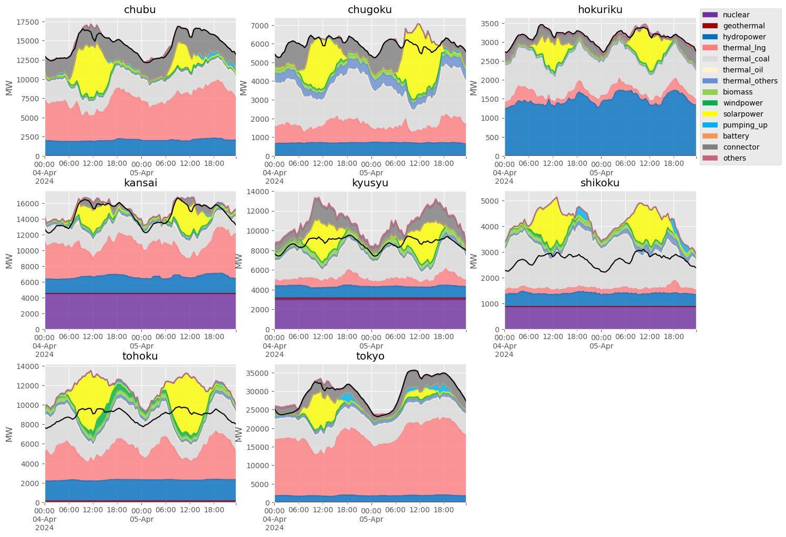

# jpelectricdata

各電力会社の需給実績データを収集するスクリプト

## Installation

1. Clone the repo

```bash
git clone https://github.com/earth06/jpelectricdata.git
```

2. データベースファイルの初期化

```bash
cd jpelectricdata
./setup.sh
```

3. chromedriverの配置

以下からchromedriverをダウンロード
https://googlechromelabs.github.io/chrome-for-testing/

```bash
mv chromedriver jpelectricdata/src/bin
```


## Usage

1. 最新データの取得

```bash
python ./src/scraping_electricity.py 
```

2. 年月を指定しデータを取得する

```bash
python ./src/scraping_electricity.py --date '2024-03'
```


3. 手動でダウンロードしたファイルをデータベースに登録する

```bash
python ./src/scraping_electricity.py  --file eria_jukyu_03_04.csv --area_name 'xxxx'
```

4. 全エリア需給プロット

```python
from electric_analysis import ElectricAnalysis
anal = ElectricAnalysis()
anal.load_demand_supply(begin="2024-04-04",end="2024-04-06")
fig,ax=anal.plot_all_demand_supply()
``` 




## License

[MIT](https://choosealicense.com/licenses/mit/)

## 連絡先

nnnkjktkt119@gmail.com

